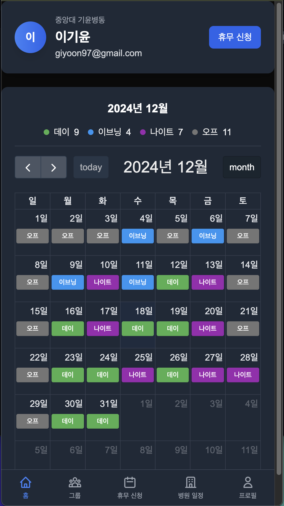
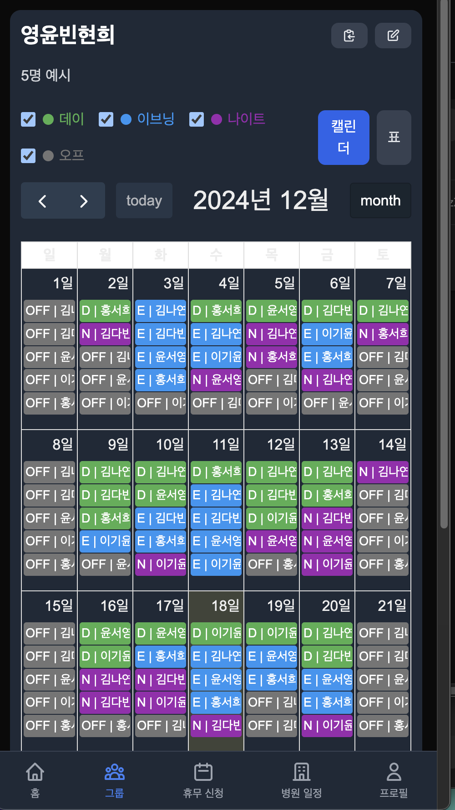
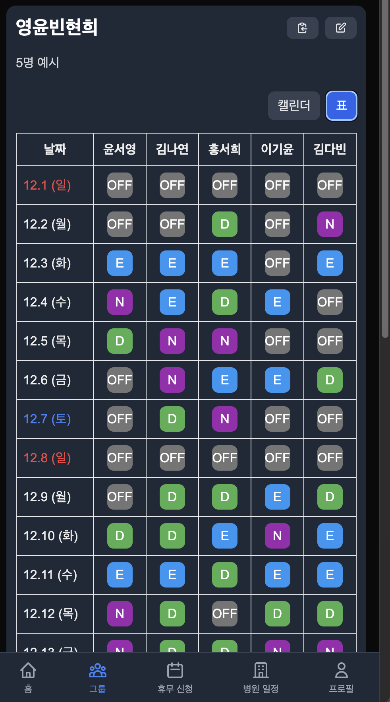
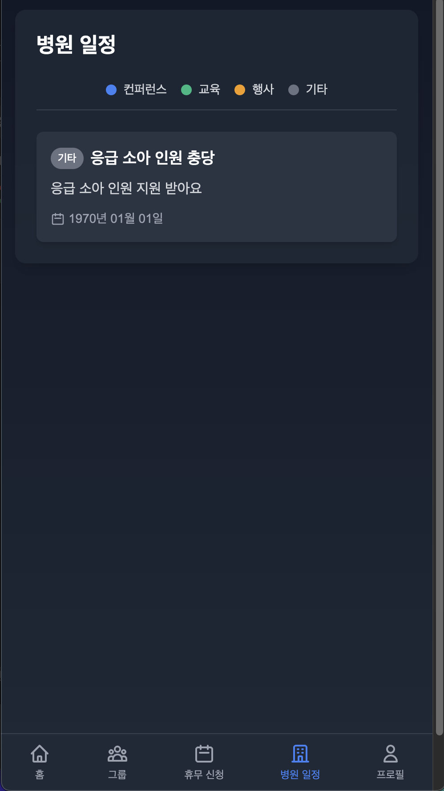
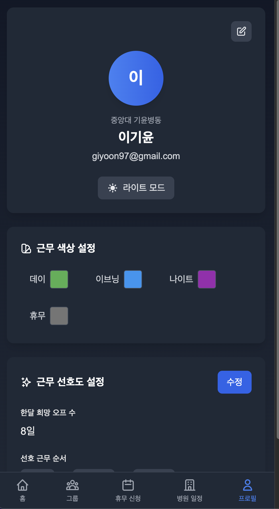

# Nurse Schedule






이 프로젝트는 간호사 스케줄 관리 시스템입니다. 이 시스템은 간호사들이 자신의 근무 일정을 관리하고, 그룹을 생성하거나 참여할 수 있도록 돕습니다.

## 시작하기

개발 서버를 실행하려면 다음 명령어를 사용하세요:

```bash
npm run dev
# or
yarn dev
# or
pnpm dev
# or
bun dev
```

Open [http://localhost:3000](http://localhost:3000) with your browser to see the result.

You can start editing the page by modifying `app/page.tsx`. The page auto-updates as you edit the file.

This project uses [`next/font`](https://nextjs.org/docs/app/building-your-application/optimizing/fonts) to automatically optimize and load [Geist](https://vercel.com/font), a new font family for Vercel.

## 주요 기능

- **회원가입 및 로그인**: 사용자는 이메일과 비밀번호를 통해 회원가입 및 로그인을 할 수 있습니다.
- **그룹 관리**: 사용자는 그룹을 생성하고, 초대 코드를 통해 그룹에 참여할 수 있습니다.
- **근무 일정 관리**: 사용자는 자신의 근무 일정을 확인하고, 선호하는 근무 형태를 설정할 수 있습니다.
- **프로필 관리**: 사용자는 자신의 프로필 정보를 수정할 수 있습니다.

## 기술 스택

- **Next.js**: React 기반의 프레임워크로, 서버 사이드 렌더링 및 정적 사이트 생성을 지원합니다.
- **Prisma**: 데이터베이스 ORM으로, 데이터베이스와의 상호작용을 단순화합니다.
- **Firebase**: 사용자 인증 및 파일 저장을 위한 백엔드 서비스로 사용됩니다.

## 추가 리소스

- [Next.js Documentation](https://nextjs.org/docs) - Next.js의 기능과 API에 대해 알아보세요.
- [Learn Next.js](https://nextjs.org/learn) - Next.js의 인터랙티브 튜토리얼을 확인하세요.

## Vercel에 배포하기

Next.js 앱을 배포하는 가장 쉬운 방법은 Vercel 플랫폼을 사용하는 것입니다. [Vercel Platform](https://vercel.com/new?utm_medium=default-template&filter=next.js&utm_source=create-next-app&utm_campaign=create-next-app-readme)을 확인하세요.

자세한 내용은 [Next.js 배포 문서](https://nextjs.org/docs/app/building-your-application/deploying)를 참조하세요.
